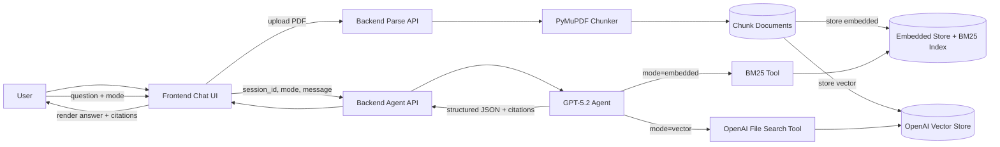

# ADR 0001: End-to-End RAG Specification Orchestration

- Status: Accepted
- Date: 2026-02-17

## Context
Synextra needs a coordinated architecture for PDF ingestion, chunking, dual retrieval backends, GPT-5.2-powered question answering with citations, and a frontend that renders structured responses in a dark extensible design system. The implementation will be delivered across backend and frontend modules with strict TDD and subagent-assisted review gates.

## Decision
Adopt a split-retrieval architecture with two ingestion persistence paths:
1. Embedded local chunk store for low-latency BM25 sparse retrieval.
2. OpenAI vector store for managed retrieval via file search.

Expose backend APIs that separate concerns:
- Parse/chunk ingestion endpoint.
- Embedded-store write endpoint.
- Vector-store write endpoint.
- Session chat endpoint that routes retrieval tools based on frontend-selected `mode`.

Require GPT-5.2 agent responses to conform to a structured JSON schema containing answer text, citation list, and optional tool-trace metadata. The frontend is responsible for turning this contract into chat-like rendering.

Use task-driven delivery with JSON task contracts and ADR-linked implementation scopes. Execute via parallel branches/worktrees with subagent review before merge.

## Diagram

## Alternatives Considered
1. Single retrieval backend only (embedded or vector only)
- Pros: less complexity, fewer APIs.
- Cons: cannot compare latency/quality trade-offs or support mode-based runtime routing required by product.

2. Unstructured free-form model responses without schema
- Pros: easier prototyping.
- Cons: unpredictable client parsing, weak citation guarantees, and fragile UI rendering.

3. Frontend-side retrieval orchestration
- Pros: less backend logic.
- Cons: leaks retrieval/provider coupling to UI, weaker security controls, and poor session-level observability.

## Consequences
- Implementation complexity increases due to two storage paths and a retrieval mode selector.
- Quality improves through explicit grounding contracts, schema validation, and citations-first response structure.
- The frontend can evolve into verifier/fixer agent workflows without changing the core response contract.

## Follow-up Actions
1. Implement backend task specs in `backend/tasks/BE-2026-02-17-002.json`, `backend/tasks/BE-2026-02-17-003.json`, and `backend/tasks/BE-2026-02-17-004.json`.
2. Implement frontend task specs in `frontend/tasks/FE-2026-02-17-002.json`, `frontend/tasks/FE-2026-02-17-003.json`, and `frontend/tasks/FE-2026-02-17-004.json`.
3. Add integration tests that run end-to-end against `1706.03762v7.pdf` and verify citation grounding in both retrieval modes.
