# ADR 0002: PDF Ingestion and Block Chunking

- Status: accepted
- Date: 2026-02-17

## Context

The backend needs a deterministic PDF ingestion path that preserves source fidelity for downstream retrieval and citation rendering.

Constraints:

- Uploads must be accepted through a FastAPI endpoint.
- Chunking must preserve page-level provenance for citations.
- The pipeline should be efficient enough for common research PDFs without introducing heavyweight preprocessing jobs in the first iteration.

## Decision

Implement `POST /v1/rag/pdfs` as the ingestion endpoint and use PyMuPDF block extraction (`page.get_text("blocks")`) as the canonical parsing strategy.

Chunking decisions:

- Sort blocks per page by vertical and horizontal position to preserve reading order.
- Normalize whitespace and drop non-informative fragments.
- Build chunks by aggregating contiguous blocks to a token target (default 700 tokens) with overlap (default 120 tokens).
- Persist chunk metadata with `document_id`, `chunk_id`, `page_number`, block bounding boxes, and source checksums to support exact citations and replayability.

### Ingestion Flow

```mermaid
flowchart LR
  A[Client uploads PDF] --> B[FastAPI /v1/rag/pdfs]
  B --> C[Validate mime type and checksum]
  C --> D[PyMuPDF extract blocks per page]
  D --> E[Order and normalize blocks]
  E --> F[Token-aware chunk builder]
  F --> G[Chunk metadata + provenance]
  G --> H[Persist document and chunks]
  H --> I[Return document_id and chunk stats]
```

### Optimization and Review Notes

- Keep chunking deterministic and pure so behavior can be unit-tested and benchmarked.
- Preserve block geometry even if not immediately used by retrieval; this supports future citation highlighting in the frontend.
- Treat oversized blocks as splittable by sentence boundaries before hard token clipping.
- Defer OCR fallback for scanned PDFs to a follow-up ADR to keep first delivery scope bounded.

## Alternatives Considered

1. Plain-text extraction with recursive character splitting

- Pros: simple implementation; many examples.
- Cons: loses geometric context, making precise page/block citations less reliable.

2. OCR-first pipeline for all PDFs

- Pros: handles image-heavy scans uniformly.
- Cons: higher latency/cost and unnecessary quality loss for digitally-native PDFs.

3. PDFMiner layout extraction instead of PyMuPDF blocks

- Pros: mature parser and layout options.
- Cons: slower extraction and less ergonomic geometry metadata handling for this backend stack.

## Consequences

- Citation quality improves because chunk provenance is retained at page/block granularity.
- Parsing remains fast for research-style PDFs while preserving room for later OCR fallback.
- The ingestion API becomes a hard dependency for both embedded and vector persistence stages.

## Follow-up Actions

- Implement the task spec in `backend/tasks/BE-2026-02-17-002.json`.
- Validate integration with `1706.03762v7.pdf` as a canonical QA fixture.
