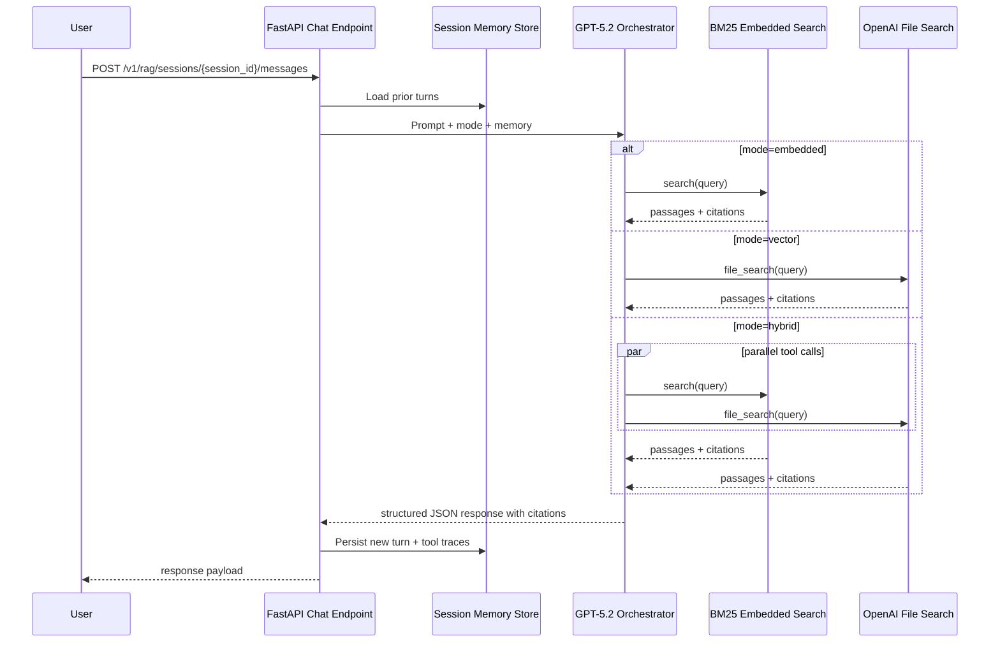

# ADR 0003: Dual-Store Retrieval and Agent Orchestration

- Status: accepted
- Date: 2026-02-17

## Context

The product needs retrieval behavior that can switch between local deterministic search and hosted semantic search, while maintaining consistent chat output contracts.

Constraints:

- Persist data to two independent stores: an embedded store and an OpenAI vector store.
- Agent behavior must choose tools conditionally by mode.
- Conversation memory must be session-aware.
- Outputs must be structured JSON and include citations.

## Decision

Adopt a dual-store retrieval architecture and a GPT-5.2 based orchestration layer with explicit mode control.

Mode behavior:

- `embedded`: call BM25/local embedded retrieval tool.
- `vector`: call OpenAI vector `file_search` tool.
- `hybrid`: call both tools in parallel and merge/rerank evidence before response generation.

Orchestration decisions:

- Expose separate persistence endpoints for each store to allow isolated retries and observability.
- Persist conversation turns by `session_id` and fetch recent context per request.
- Allow multiple tool calls and parallel dispatch with bounded concurrency.
- Validate final agent output against a strict JSON schema requiring citations for each factual claim.

### Retrieval and Orchestration Sequence

## Alternatives Considered

1. Vector-store only retrieval

- Pros: strong semantic recall with minimal local indexing logic.
- Cons: reduced control over deterministic ranking and more dependence on hosted tool behavior.

2. Embedded-store only retrieval

- Pros: deterministic behavior and lower external dependency surface.
- Cons: weaker semantic matching for paraphrased queries without additional embedding/reranking complexity.

3. Single-chain orchestration without explicit mode control

- Pros: less API surface.
- Cons: hard to debug and hard to enforce predictable tool usage by environment or product mode.

## Consequences

- Operators can tune latency/quality tradeoffs by selecting mode per request.
- Parallel hybrid retrieval increases answer quality but introduces merge/rerank complexity.
- Strict citation validation improves trust but requires explicit failure handling when evidence is missing.

## Follow-up Actions

- Implement persistence routes in `backend/tasks/BE-2026-02-17-003.json`.
- Implement orchestration and session memory in `backend/tasks/BE-2026-02-17-004.json`.
- Validate hybrid retrieval and citation output against `1706.03762v7.pdf` integration fixtures.
