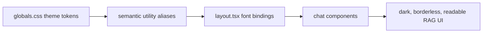

# ADR 0002: Dark Theme Typography Design System

- Status: Accepted
- Date: 2026-02-17

## Context

The RAG chat redesign requires a deliberate dark visual language: black background, borderless surfaces, and legible hierarchy across long-form assistant text, citation metadata, and tool/code outputs. Current styling is scaffold-level and does not yet define reusable design tokens or a consistent multi-font system.

## Decision

Adopt a global tokenized design system in `frontend/src/app/globals.css` and semantic helpers, with:

- dark-first color tokens anchored on black backgrounds
- borderless container rules for core chat surfaces
- stone gradient text utility for page titles
- typography stack:
  - display/title: serif with italic emphasis
  - message body: uncommon sans family
  - code/tool output: JetBrains Mono

Font loading will be centralized in `layout.tsx` so the typography contract is shared across app shell and chat components.

## Diagram

## Alternatives considered

### Alternative 1: Keep default Tailwind/system theme and fonts

- Pros:
  - Minimal implementation effort.
  - No new design-token maintenance.
- Cons:
  - Does not satisfy black/no-border visual requirement.
  - Weak information hierarchy for mixed prose/citation/tool output.

### Alternative 2: Component-local styling only (no global tokens)

- Pros:
  - Fast local experiments per component.
  - Avoids up-front token design.
- Cons:
  - High risk of style drift and duplication.
  - Hard to enforce consistent typography and contrast over time.

### Alternative 3: Theme toggle with light mode default

- Pros:
  - Accessibility flexibility for user preference.
  - Familiar design convention.
- Cons:
  - Expands scope beyond current requirement.
  - Increases QA matrix before core dark-mode spec is stable.

## Consequences

- Styling decisions become centralized and easier to extend.
- Designers and implementers gain deterministic class/token usage for future features.
- Existing components will require migration away from border-based visual separation.

## Follow-up actions

- Add token and typography class coverage in unit/component tests before style changes.
- Add screenshot/manual Playwright checks for desktop and mobile contrast/readability.
- Define extension guidance for future surfaces to prevent border utility reintroduction.

## References

- [Tailwind CSS theme variables](https://tailwindcss.com/docs/theme)
- [Next.js font optimization](https://nextjs.org/docs/app/getting-started/fonts)
