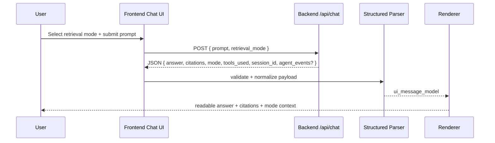

# ADR 0003: Structured Chat Rendering and Mode Routing

- Status: Accepted
- Date: 2026-02-17

## Context

Backend RAG responses are moving to structured JSON with an `answer`, `citations`, `mode`, `tools_used`, and `session_id`. The frontend must translate this payload into readable chat messages, keep citations traceable, and forward a user-selected retrieval mode for backend conditional branching. The same flow should remain extensible for optional future verifier/fixer metadata without making that metadata a required v1 contract field.

## Decision

Define a typed frontend response contract and routing strategy:

- validate backend JSON through a schema layer before rendering
- normalize payloads into a UI-ready message model centered on `answer` and citation metadata
- render citations as first-class message metadata
- include `retrieval_mode` in each outbound chat request from a dedicated mode selector with allowed values `embedded|vector|hybrid`
- keep an extensible optional metadata adapter for future `agent_events` kinds with safe fallback for unknown values

This keeps parsing deterministic, routing explicit, and future agent integration incremental.

## Diagram

## Alternatives considered

### Alternative 1: Render raw backend JSON/markdown directly

- Pros:
  - Lowest up-front implementation effort.
  - Minimal transformation layer.
- Cons:
  - Poor readability and inconsistent chat UX.
  - Hard to validate or evolve with richer metadata.

### Alternative 2: Parse with untyped `any` objects and inline conditionals

- Pros:
  - Quick prototyping.
  - Fewer initial files.
- Cons:
  - High runtime failure risk on schema drift.
  - Difficult to test systematically across malformed payloads.

### Alternative 3: Omit UI mode selector and keep backend mode hardcoded

- Pros:
  - Simpler request payload and UI.
  - Reduced initial feature surface.
- Cons:
  - Cannot exercise backend conditional retrieval branches from UI.
  - Blocks product experiments and verification of mode-specific behavior.

## Consequences

- Frontend gains stronger runtime safety and predictable rendering behavior.
- Integration tests can explicitly assert mode forwarding and citation rendering.
- Future verifier/fixer metadata can be introduced through adapter extensions without redesigning base chat components.

## Follow-up actions

- Add parser contract tests for valid, partial, malformed payloads plus strict citation/object shape validation.
- Add integration tests asserting outbound `retrieval_mode` enum alignment (`embedded|vector|hybrid`) and inbound mode-aware rendering.
- Add Playwright manual checks for citation visibility, mode switching, and optional unknown event fallback behavior.

## References

- [Zod](https://github.com/colinhacks/zod)
- [Next.js Route Handlers](https://nextjs.org/docs/app/building-your-application/routing/route-handlers)
